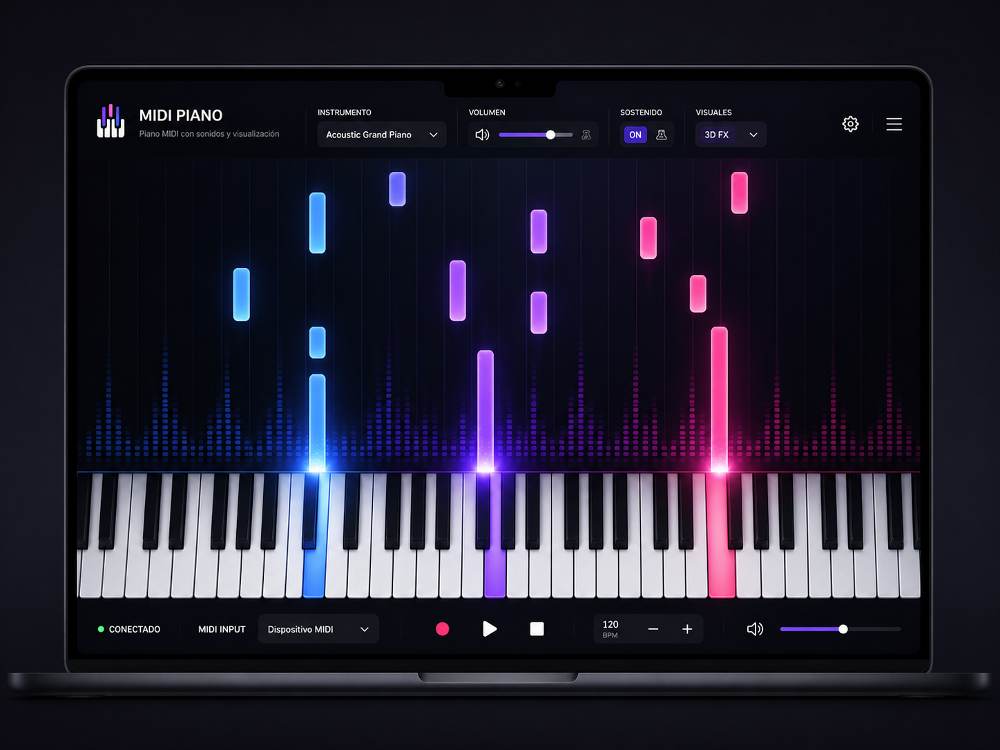

# Midibian



Teclado MIDI interactivo de escritorio construido con **Tauri 2**, **Rust** y **WebGL**. El backend en Rust gestiona la síntesis de audio mediante FluidSynth con latencia mínima, mientras que el frontend renderiza visualizaciones en tiempo real usando Three.js (modo 3D) y Canvas 2D nativo (modo Synthesia).

## Características

- Detección y conexión automática de controladores MIDI físicos
- Síntesis de audio por SoundFont (`.sf2`) a través de FluidSynth en hilo dedicado
- Tres modos visuales: **3D FX** (shaders WebGL con partículas), **2D FX** (estilo Synthesia, Canvas 2D optimizado) y **OFF**
- Pedal de sustain, selección de instrumento General MIDI y control de volumen maestro
- Soporte de teclado de computadora como controlador MIDI
- Empaquetado nativo para Linux (`.deb`, `.rpm`, `.AppImage`)

## Requisitos

### Dependencias del sistema (Debian/Ubuntu)

```bash
sudo apt update
sudo apt install libwebkit2gtk-4.1-dev build-essential curl wget file \
    libxdo-dev libssl-dev libayatana-appindicator3-dev librsvg2-dev \
    fluidsynth fluid-soundfont-gm
```

### SoundFont

La aplicación carga automáticamente `/usr/share/sounds/sf2/FluidR3_GM.sf2` si existe (instalado por `fluid-soundfont-gm`). Como alternativa, coloca cualquier archivo `.sf2` renombrado como `default.sf2` en el directorio del ejecutable.

## Instalación

### Desde el paquete precompilado

Descarga el `.deb` de la sección [Releases](../../releases) e instala con:

```bash
sudo dpkg -i Midibian_0.1.0_amd64.deb
```

Si faltan dependencias:

```bash
sudo apt-get install -f
```

### Compilar desde el código fuente

Requisitos previos: [Rust](https://rustup.rs/) y Node.js 18+.

```bash
git clone https://github.com/Markox36/pianomidi.git
cd pianomidi
npm install
npm run tauri build
sudo dpkg -i src-tauri/target/release/bundle/deb/Midibian_0.1.0_amd64.deb
```

## Modo desarrollo

```bash
npm run tauri dev
```

> **Linux con NVIDIA/KMS**: si la ventana aparece en blanco por conflicto con el driver, deshabilita la aceleración de compositing:
> ```bash
> PIANO_NO_HW_ACCEL=1 npm run tauri dev
> ```

## Stack

| Capa | Tecnología |
|---|---|
| Empaquetado | Tauri 2 |
| Backend / audio | Rust, FluidSynth, midir |
| Visualización 3D | Three.js (WebGL, shaders GLSL) |
| Visualización 2D | Canvas 2D API |
| UI | HTML/CSS, Glassmorphism |

## Licencia

MIT
